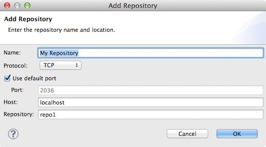
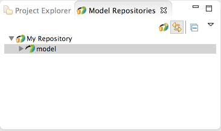
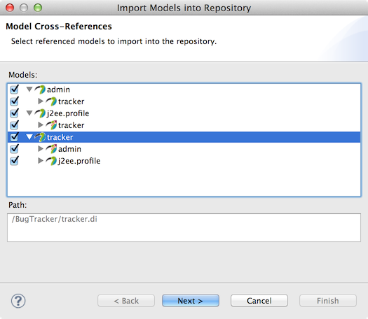
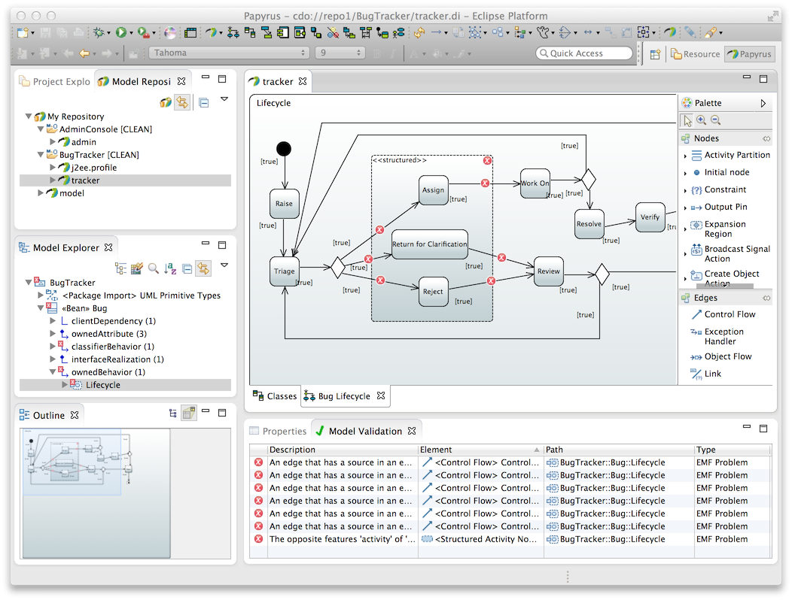

# Working with CDO Model Repositories
This document is a brief guide to getting started with Papyrus UML models in the CDO Model Repository.

For more information about CDO, see the [EMF CDO wiki](http://wiki.eclipse.org/CDO).

## <a id="Installing">Installation</a>
The CDO Model Repository integration feature is not installed by default with Papyrus; it is an optional extra component.  To install this feature, open the Papyrus discovery wizard from the **Help &rarr; Install Papyrus Additional Components** menu.  You should find an entry like the following in the list:

Select the CDO integration feature by checking the box on the left side and press **Finish** to perform the installation.

## <a id="Connecting">Connecting to a Repository</a>
Repository connections are managed in the **Model Repositories** view.  Use the **Add Repository...** button in the view to create a new repository connection:

If your repository requires user authentication, a login dialog will appear to accept your credentials.

The new repository is then added to the view.  Select the new repository and pick **New Papyrus Model** in the context menu.  Complete the wizard.  You should now have a new blank model open and something like this in the **Model Repositories** view:

Note that because it is necessary to explicitly connect to model repositories, any model editors that are open when shutting down the Papyrus workbench are not re-opened on next launch.

## <a id="Importing">Importing Models from the Workspace</a>

You probably already have models in your workspace that you would like to import into a repository.  To do this, select one or more models in the **Project Explorer** and choose the **Import into Repository...** action in the context menu.  Alternatively, just drag and drop one or more model onto a repository.

By default, the wizard maps incoming models to paths in the repository according to their paths in the workspace.  This mapping may be customized in the last page.

As a first step, the wizard analyzes the selected models for cross-reference dependencies.  It is highly recommended also to import any models that references the initially selected models.  Otherwise, they will be updated to reference the models in the repository and it may be difficult to edit them when Papyrus is not connected to the repository.

It is also suggested to import models referenced by the initial selection.  However, references from models in a repository to models in the workspace do not present the same kind of problem of availability as the reverse case.

## <a id="Validating">Validating Models</a>

The **Validate** context menu actions work in repository models just as in workspace models.  Annotations are presented in the diagrams and in the **Model Explorer** view.  The difference is that validation issues are not shown in the **Problems** view.  Instead, they are shown in a new **Model Validation** view:

The **Model Validation** view supports the usual functions, including:

* double-click navigation to the problem element in the editor
* copy selected problems to CSV text on the system clipboard
* delete problems

